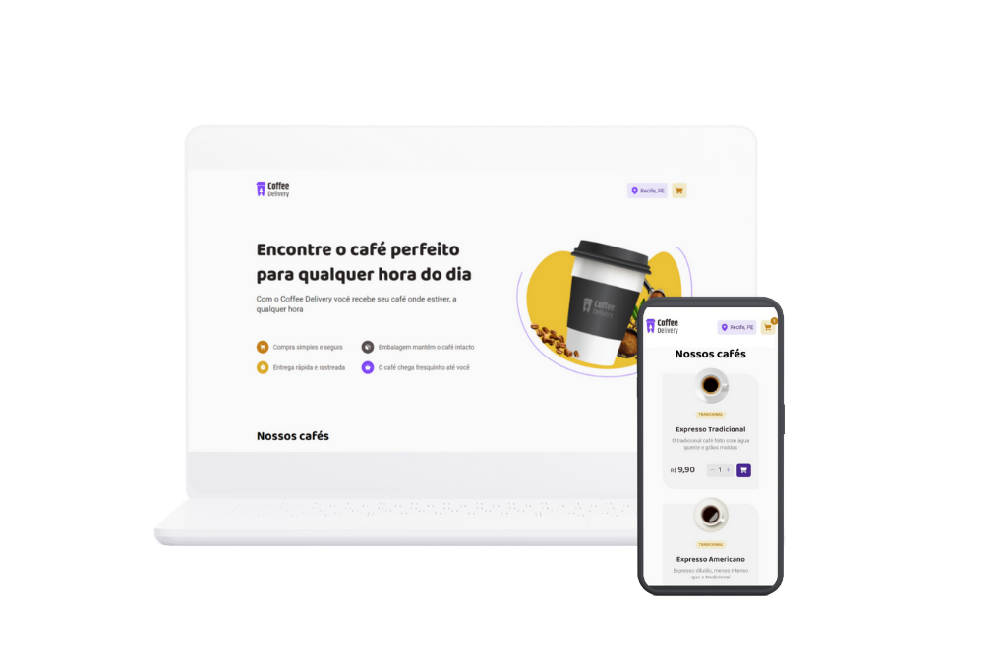

<h1 align="center">Coffee Delivery ☕️</h1>

  

Coffee Delivery é um e-commerce de cafés onde os usuários podem explorar diferentes tipos de café, adicionar itens ao carrinho e fazer pedidos. Este projeto foi desenvolvido utilizando as tecnologias Vite, React, Styled Components, React Router DOM e Context API.

## Funcionalidades 🚀

O Coffee Delivery oferece as seguintes funcionalidades:

- Listagem de cafés: Os usuários podem visualizar uma lista de diferentes tipos de café disponíveis para compra.
- Adicionar ao carrinho: Os usuários podem adicionar cafés ao carrinho de compras.
- Carrinho de compras: O carrinho de compras exibe todos os itens selecionados pelos usuários, permitindo que eles ajustem as quantidades ou removam produtos e forneça as informações de entrega necessárias.
- Finalização do pedido: Após revisar os itens no carrinho, os usuários podem finalizar o pedido, e ver as informações de entrega.

## Instalação 💻

Siga as etapas abaixo para instalar e executar o projeto Coffee Delivery:

1. Faça o clone deste repositório para o seu ambiente local.
2. Navegue até o diretório do projeto no terminal.
3. Execute o comando `npm install` para instalar todas as dependências do projeto.
4. Após a conclusão da instalação, execute o comando `npm run dev` para iniciar o servidor de desenvolvimento.
5. O servidor será iniciado e você poderá acessar o aplicativo Coffee Delivery no seu navegador através do endereço `http://localhost:5173`.

## Uso 🎯

Após iniciar o aplicativo Coffee Delivery, você terá acesso às seguintes páginas:

- Página inicial: Exibe a lista de cafés disponíveis para compra. Você pode navegar pelos diferentes tipos de café e selecionar aqueles que deseja adicionar ao carrinho.
- Carrinho de compras: Após adicionar itens ao carrinho, você pode acessar a página do carrinho para revisar os produtos selecionados. Aqui, você pode ajustar as quantidades ou remover itens conforme necessário.
- Página de detalhes de entrega: Após finalizar o pedido, você pode acessar essa página para visualizar os detalhes da entrega, como endereço de entrega, prazo estimado e outras informações relevantes.